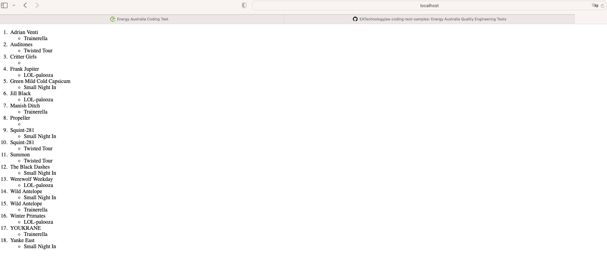

The framework has been developed using Cypress and type script framework
The idea is to modularize the framework to enhance reusibility and ease the maintainence.

Scenario: Your team is tasked with listing out music festival data in a particular manner.

Given that data is provided and assured all data is provided. I went through the swagger documentation to understand the API response structurte and noticed.
1. The Structure on UI shows the Band Name and the festival they are goin to play in.
2. API returns may return different data.
3. Festival Name can be blank

The test I have written covers the scenario where 
 1.response is returned and is not blank
 2. Intercept the API and get the response.
 3. Grab the li elements.
 4. Iterate through the li elements and compare to the JSON response.
 5. Verify that the Band: Festival mapping on UI matches the JSON object. 

 If we want to throw an error where festival name is not provided, can update the assertion ( but I'm assuming the data provided is correct and when festival provided is correct. )

Improvements
 I would like to modularize the framework further by creating actions which uses the driver, pageobjects and assertions . and use actions in test . 
 Would improve the framework to be ENV variable driver, i.e load configs and test data based on env variables provided.

 P.S , My understanding of what needs to be validated on the website using the data may be different and am open to suggestions and feedback.

 Good Day, 
 Regards
 Parth Dave